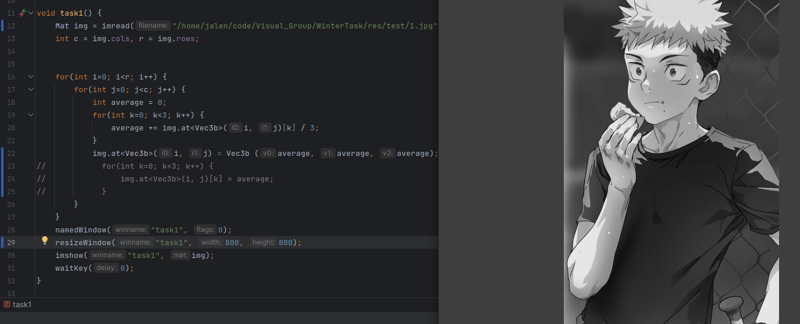
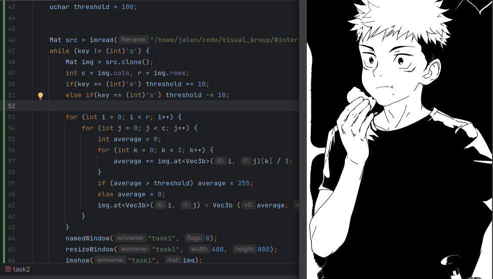

# WinterTask

## OpenCV

### 1

3 个通道的值统一改为 3 个通道的平均值

通道的值 `img.at<Vec3b>(i, j)[0-2]`

整体赋值
```c++
img.at<Vec3b>(i, j) = Vec3b(average, average, average);
```

图片变灰



### 2 && 3

简单实现之后想用按键控制 `threshold` 值的增减，更直观的看出变化。
一开始没有多想就直接把修改的那一段放进循环里面，但是发现图像没变化，
后面想起来，从第一次修改之后，通道的值已经发生了变化，图像已经变成黑白的了，此时三通道的数值已经完全相同，不会再改变。

于是就想着再新建一个 `Mat src` 用来读取图片， `Mat img = src`，从 `src` 读取通道的值，修改 `img` 的通道值。
本来以为解决了，但是发现还是没变化。之后突然想到 `Mat` 本应该是没有 `=` 操作的，应该是重载过了。
了解之后发现 `a = b` 只是将 `a` 的各个地址的值改为 `b` 的，在操作的时候两者会一起改变。

感觉 `=` 相当于是引用，而真正地复制可以用 `a = b.clone()` `b.CopyTo(a)`。
`clone()` 实际上是新建一个 `Mat m` 然后执行 `CopyTo`，再返回 `m`。



### 4

```c++
// 通道分离
split(src, channels);

channels.at(i) // 012 BGR

// 通道合并
merge(channels, mergeIMG);
```

